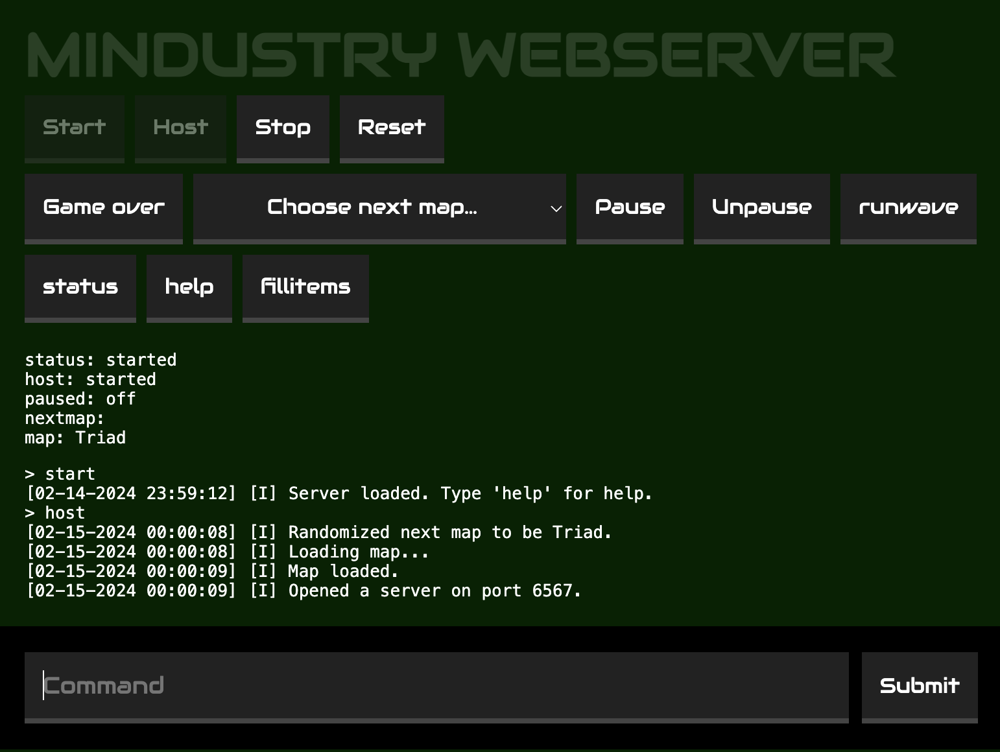

## Mindustry Webserver

Manage your Mindustry server from a web interface.



Goals:

- [ ] Protect the webserver with a password
- [x] Download the server binary lazily
- [x] Follow logs
- [x] Start and stop the server
- [x] Start next game
- [x] Send waves
- [x] Choose next map
- [ ] Vote on the next map
- [ ] Change rules

## Getting started

Make sure [Docker](https://docs.docker.com/get-docker/) is installed. Then run this command locally or on a server to run a temporary server:

```sh
# Port 80:
docker run --rm -it -p 6576:6567 -p 80:80 thgh/mindustry-webserver
# Or use another port:
$PORT=24024
docker run --rm -it -p 6576:6567 -e PORT=$PORT -p $PORT:$PORT thgh/mindustry-webserver
# Press Ctrl+C to stop the server
```

## Mount config directory

For long term use, mount a directory to `/app/config` to keep the configuration and save files:

```sh
docker run --name mindustry -v config:/app/config thgh/mindustry-webserver
```
